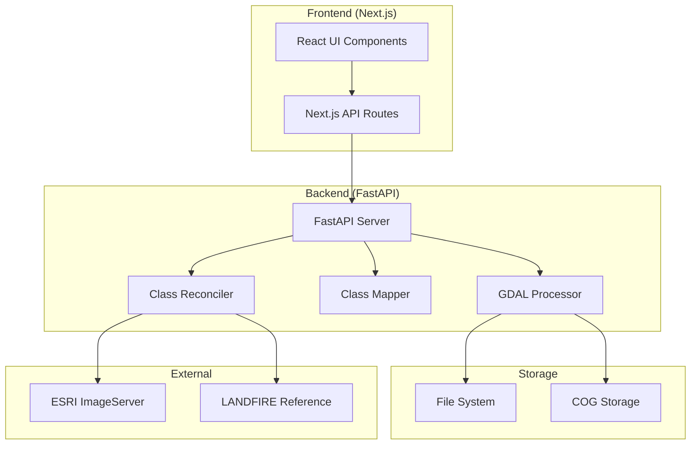

# Fuel Map Integration Platform

A comprehensive geospatial data processing platform for wildfire fuel map integration, featuring automatic class reconciliation from ESRI PFA to FBFM40 standards, multi-tenant support, and advanced web-based visualization.

## Key Features

### Core Capabilities
- **Automatic Class Reconciliation**: Intelligent mapping from ESRI PFA land cover classes to FBFM40 fuel model standards
- **Grid Alignment**: Automatic alignment to LANDFIRE 30m grid system for seamless integration
- **Cloud Optimized GeoTIFF (COG)**: Efficient storage and web-serving of large geospatial datasets
- **Multi-Tenant Architecture**: Complete data isolation between customers with tenant-specific storage
- **Interactive Web Interface**: React-based dashboard with real-time map visualization

### Advanced Processing
- **Classification Detection**: Automatic identification of input classification systems (ESRI PFA, LANDFIRE, Sentinel, etc.)
- **Projection Handling**: Automatic reprojection to NAD83 / Conus Albers (EPSG:5070)
- **Resolution Preservation**: Maintains input resolution (10m for Sentinel) while aligning to 30m grid
- **Large File Support**: Handles GeoTIFF files up to 10GB with streaming processing
- **Batch Operations**: Delete all datasets functionality for easy data management

## Prerequisites

- Python 3.9 or higher
- Node.js 18.x or higher
- GDAL 3.0 or higher
- 8GB RAM minimum (16GB recommended for large files)
- 10GB free disk space

## Installation

### 1. Clone the Repository

```bash
git clone <repository-url>
cd ororatech-task
```

### 2. Install GDAL

**macOS:**
```bash
brew install gdal
```

**Ubuntu/Debian:**
```bash
sudo apt-get update
sudo apt-get install gdal-bin libgdal-dev
```

**Windows:**
Download and install from [OSGeo4W](https://trac.osgeo.org/osgeo4w/)

### 3. Set Up Python Environment (Backend)

```bash
cd geospatial-service

# Create virtual environment
python -m venv venv

# Activate virtual environment
# On macOS/Linux:
source venv/bin/activate
# On Windows:
# venv\Scripts\activate

# Install Python dependencies
pip install -r requirements.txt
```

### 4. Set Up Node.js Environment (Frontend)

```bash
cd ../fuel-map-integration

# Install Node dependencies
npm install
```

## Python Requirements

Create `geospatial-service/requirements.txt`:

```txt
# FastAPI and Server
fastapi==0.104.1
uvicorn[standard]==0.24.0
python-multipart==0.0.6

# Geospatial Processing
rasterio==1.3.9
GDAL==3.8.0  # Should match system GDAL version
numpy==1.24.3
shapely==2.0.2

# Data Processing
pydantic==2.5.0
python-dotenv==1.0.0

# Utilities
aiofiles==23.2.1
psutil==5.9.6
```

## Running the Application

### Start the Backend Server

```bash
cd geospatial-service

# Activate virtual environment if not already active
source venv/bin/activate  # macOS/Linux
# or
venv\Scripts\activate  # Windows

# Start FastAPI server
uvicorn app.main:app --host 0.0.0.0 --port 8001 --reload
```

The backend API will be available at: `http://localhost:8001`

### Start the Frontend Server

In a new terminal:

```bash
cd fuel-map-integration

# Start Next.js development server
npm run dev
```

The frontend will be available at: `http://localhost:3000`

## Project Structure

```
ororatech-task/
├── geospatial-service/              # FastAPI Backend Service
│   ├── app/
│   │   ├── main.py                 # FastAPI application & endpoints
│   │   ├── models/                 # Pydantic data models
│   │   │   └── dataset.py          # Dataset & classification models
│   │   └── services/               # Core business logic
│   │       ├── gdal_processor.py   # GDAL operations & COG conversion
│   │       ├── class_mapper.py     # Classification detection & mapping
│   │       └── mock_gdal_processor.py  # Testing utilities
│   └── requirements.txt            # Python dependencies
│
├── fuel-map-integration/            # Next.js Frontend Application
│   ├── app/                        # Next.js app router
│   │   ├── api/                   # API route handlers
│   │   │   ├── process-geospatial/ # File upload proxy
│   │   │   ├── datasets/          # Dataset CRUD operations
│   │   │   ├── coverage/          # Coverage analysis
│   │   │   ├── fuel-query/        # Fuel data queries
│   │   │   └── detect-classification/ # Classification detection
│   │   ├── page.tsx               # Main application page
│   │   └── layout.tsx             # Root layout
│   ├── components/                # React components
│   │   ├── FileUploadZone.tsx    # Drag-drop file upload
│   │   ├── DatasetDashboard.tsx  # Dataset management UI
│   │   ├── CoverageMap.tsx       # Interactive Leaflet map
│   │   ├── ClassMappingReview.tsx # Class mapping visualization
│   │   └── ProcessingStatus.tsx  # Upload progress tracking
│   ├── lib/                      # Utilities
│   │   └── api-client.ts         # API client functions
│   ├── package.json              # Node dependencies
│   └── next.config.js            # Next.js configuration
│
├── class_reconciliation_enhanced.py # Standalone ESRI->FBFM40 processor
├── download_esri_lulc.py          # ESRI data downloader utility
│
└── storage/                        # Data storage (auto-created)
    └── [tenant_id]/               # Tenant-specific storage
        ├── original/              # Raw uploaded files
        ├── processed/             # Reconciled FBFM40 files
        └── cog/                   # Cloud Optimized GeoTIFFs

## Class Reconciliation System

### Overview
The platform features an advanced class reconciliation system that automatically converts ESRI PFA land cover classifications to FBFM40 fuel model standards.

### ESRI PFA to FBFM40 Mapping Table

| ESRI PFA Class | Name | FBFM40 Code | FBFM40 Description | Confidence |
|----------------|------|-------------|-------------------|------------|
| 1 | Water | 98 | NB8 - Open Water | 95% |
| 2 | Trees | 183 | TL3 - Moderate load conifer litter | 55% |
| 4 | Flooded vegetation | 121 | GS1 - Low load grass-shrub mix | 60% |
| 5 | Crops | 102 | GR2 - Low load, dry climate grass | 75% |
| 7 | Built Area | 91 | NB1 - Urban/Developed | 90% |
| 8 | Bare ground | 99 | NB9 - Barren | 85% |
| 9 | Snow/Ice | 92 | NB2 - Snow/Ice | 95% |
| 10 | Clouds | 183 | TL3 - Default forest | 20% |
| 11 | Rangeland | 102 | GR2 - Low load grass | 70% |

### Processing Pipeline

1. **Detection Phase**
   - System analyzes input GeoTIFF to identify unique class values
   - Automatically detects if file contains ESRI PFA classifications

2. **Reconciliation Phase** (for ESRI_PFA files)
   - Reprojects from Web Mercator (EPSG:3857) to NAD83/Conus Albers (EPSG:5070)
   - Aligns to LANDFIRE 30m grid for seamless integration
   - Applies class mapping according to the table above
   - Preserves original resolution (10m for Sentinel data)

3. **Optimization Phase**
   - Converts to Cloud Optimized GeoTIFF (COG)
   - Creates tiled structure for efficient web serving
   - Applies LZW compression to reduce file size

### Grid Alignment Details

- **Reference Grid**: LANDFIRE CONUS 30m grid
- **Origin Point**: (-2362425.0, 3310005.0) in EPSG:5070
- **Grid Resolution**: 30m x 30m cells
- **Output Resolution**: Maintains input resolution (typically 10m) aligned to 30m grid boundaries

## Usage

### 1. Upload a Fuel Map

1. Navigate to `http://localhost:3000`
2. Click on the **Upload** tab
3. Drag and drop a GeoTIFF file or click to browse
4. System auto-detects classification (or select manually)
5. Click **Process File**
6. View real-time processing status

### 2. View Datasets

1. Click on the **Datasets** tab
2. View all uploaded datasets with metadata
3. See classification system and mapping details
4. Click **Delete All Datasets** to clear all data

### 3. View Coverage Map

1. Click on the **Coverage** tab
2. Interactive Leaflet map shows spatial extent
3. Click on polygons for dataset details
4. Zoom and pan to explore coverage

## System Architecture

### Component Overview



### Data Flow

1. **Upload Phase**
   - User uploads GeoTIFF via React UI
   - File streams through Next.js proxy to FastAPI
   - FastAPI validates file format and size

2. **Detection Phase**
   - GDAL processor extracts raster metadata
   - Class mapper analyzes unique pixel values
   - System identifies classification type (ESRI_PFA, FBFM40, etc.)

3. **Reconciliation Phase** (if needed)
   - For ESRI_PFA files:
     - Load reference LANDFIRE grid parameters
     - Reproject to EPSG:5070 (NAD83/Conus Albers)
     - Align to 30m grid boundaries
     - Apply class mappings (ESRI → FBFM40)

4. **Optimization Phase**
   - Convert to Cloud Optimized GeoTIFF
   - Create internal tiling (512x512 blocks)
   - Apply LZW compression
   - Generate overviews for zoom levels

5. **Storage Phase**
   - Save original to `storage/{tenant_id}/original/`
   - Save processed to `storage/{tenant_id}/processed/`
   - Save COG to `storage/{tenant_id}/cog/`

### Technology Stack

| Layer | Technology | Purpose |
|-------|------------|---------|
| **Frontend** | Next.js 14, React 18, TypeScript | Modern web interface |
| **UI Components** | Tailwind CSS, Radix UI | Styling and components |
| **Maps** | Leaflet, React-Leaflet | Interactive map visualization |
| **Backend** | FastAPI, Python 3.9+ | High-performance API server |
| **Geospatial** | GDAL 3.8, Rasterio 1.3 | Raster processing |
| **Processing** | NumPy, Custom Reconciler | Data transformation |
| **Storage** | File System, COG | Efficient data storage |

## Configuration

### Environment Variables

Create `.env` files if you need to customize:

**Frontend** (`fuel-map-integration/.env.local`):
```env
NEXT_PUBLIC_API_URL=http://localhost:3000
FASTAPI_URL=http://localhost:8001
```

**Backend** (`geospatial-service/.env`):
```env
STORAGE_BASE_PATH=../storage
MAX_UPLOAD_SIZE=10737418240  # 10GB in bytes
```

## Testing

### Test with Sample Data

1. **Small test file** (< 100MB): Quick processing test
2. **Large file** (1GB+): Performance testing
3. **Different projections**: EPSG:4326, EPSG:5070, etc.

### Verify Installation

**Check Backend:**
```bash
curl http://localhost:8001/health
```

**Check Frontend:**
```bash
curl http://localhost:3000/api/datasets?tenant_id=tenant_001
```

## Troubleshooting

### Common Issues

1. **GDAL Import Error**
   ```
   ImportError: cannot import name 'gdal' from 'osgeo'
   ```
   - Ensure GDAL Python bindings match system GDAL version
   - Try: `pip install GDAL==$(gdal-config --version)`

2. **Timeout on Large Files**
   - Default timeout is 10 minutes
   - For very large files, increase timeout in `next.config.js`

3. **Port Already in Use**
   ```
   Error: Address already in use
   ```
   - Kill existing process: `lsof -ti:8001 | xargs kill -9`
   - Or use different port: `--port 8002`

4. **Memory Issues with Large Files**
   - Increase Node.js memory: `NODE_OPTIONS="--max-old-space-size=4096" npm run dev`
   - Files are processed in chunks to minimize memory usage

### Debug Mode

Enable detailed logging:

```bash
# Backend
PYTHONUNBUFFERED=1 uvicorn app.main:app --log-level debug

# Frontend
DEBUG=* npm run dev
```

## API Documentation

### FastAPI Interactive Docs
Visit `http://localhost:8001/docs` for interactive API documentation with request/response schemas

### Backend API Endpoints (FastAPI - Port 8001)

#### Core Processing Endpoints

**`POST /process-fuel-map`**
Upload and process a GeoTIFF fuel map file with automatic class reconciliation.

```bash
curl -X POST "http://localhost:8001/process-fuel-map" \
  -H "Content-Type: multipart/form-data" \
  -F "file=@path/to/fuelmap.tif" \
  -F "tenant_id=tenant_001" \
  -F "classification_system=ESRI_PFA"
```

**Request Parameters:**
- `file` (required): GeoTIFF file upload (max 10GB)
- `tenant_id` (required): Tenant identifier (e.g., "tenant_001")
- `classification_system` (optional): Source classification system
  - `ESRI_PFA` - ESRI land cover (auto-reconciles to FBFM40)
  - `FBFM40` - Anderson Fire Behavior Fuel Models (no reconciliation needed)
  - `LANDFIRE_US` - LANDFIRE fuel models
  - `SENTINEL_FUEL_2024` - Sentinel-derived fuel classification
  - `CANADIAN_FBP` - Canadian Forest Fire Behavior Prediction
  - `UNKNOWN` - Auto-detect classification

**Response:**
```json
{
  "success": true,
  "dataset_id": "dataset_abc123",
  "dataset_type": "customer_private",
  "validation": {
    "is_valid": true,
    "pixel_count": 1000000,
    "resolution_meters": 10.0,
    "detected_classes": [1, 2, 4, 5, 7, 8, 9, 10, 11]
  },
  "classification": {
    "detected_system": "ESRI_PFA",
    "mapping": {
      "source_system": "ESRI_PFA",
      "target_system": "FBFM40",
      "mapping_required": true,
      "auto_mappable": true,
      "mappings": {
        "1": 98,   // Water -> Open Water
        "2": 183,  // Trees -> Moderate conifer litter
        "5": 102,  // Crops -> Low load grass fuels
        "7": 91    // Built Area -> Urban/Developed
      }
    }
  },
  "processing_time_seconds": 45.2
}
```

**`POST /validate-file`**
Validate a GeoTIFF file without processing it.

```bash
curl -X POST "http://localhost:8001/validate-file" \
  -F "file=@path/to/fuelmap.tif"
```

**`POST /detect-classification`**
Detect the classification system of an uploaded file.

```bash
curl -X POST "http://localhost:8001/detect-classification" \
  -F "file=@path/to/fuelmap.tif"
```

**`GET /classification-systems`**
Get available classification systems and their mappings.

```bash
curl "http://localhost:8001/classification-systems"
```

#### Dataset Management

**`GET /datasets`**
Retrieve all datasets for a tenant.

```bash
curl "http://localhost:8001/datasets?tenant_id=tenant_001"
```

**Response:**
```json
{
  "tenant_id": "tenant_001",
  "owned_datasets": [
    {
      "id": "dataset_abc123",
      "name": "My Fuel Map",
      "type": "customer_private",
      "classification_system": "FBFM40",
      "resolution_meters": 30.0,
      "bbox": [-120.5, 37.2, -119.8, 37.4],
      "status": "processed",
      "created_at": "2025-01-15T10:00:00Z"
    }
  ],
  "global_datasets": []
}
```

**`DELETE /datasets/delete-all`**
Delete all datasets for a tenant.

```bash
curl -X DELETE "http://localhost:8001/datasets/delete-all?tenant_id=tenant_001"
```

#### Spatial Data

**`GET /coverage/{tenant_id}`**
Get spatial coverage as GeoJSON for map visualization.

```bash
curl "http://localhost:8001/coverage/tenant_001"
```

**Response:**
```json
{
  "type": "FeatureCollection",
  "features": [
    {
      "type": "Feature",
      "properties": {
        "dataset_id": "dataset_abc123",
        "name": "My Fuel Map",
        "resolution_meters": 30.0
      },
      "geometry": {
        "type": "Polygon",
        "coordinates": [[[-120.5, 37.2], [-119.8, 37.2], [-119.8, 37.4], [-120.5, 37.4], [-120.5, 37.2]]]
      }
    }
  ]
}
```

#### Health & Statistics

**`GET /health`**
System health check.

```bash
curl "http://localhost:8001/health"
```

**`GET /tenants/{tenant_id}/stats`**
Get tenant statistics.

```bash
curl "http://localhost:8001/tenants/tenant_001/stats"
```

**Response:**
```json
{
  "total_datasets": 5,
  "private_datasets": 3,
  "shared_datasets": 0,
  "global_datasets": 2,
  "total_storage_mb": 1024.5,
  "total_coverage_km2": 15000.0
}
```

### Frontend API Routes (Next.js - Port 3000/3002)

#### File Processing

**`POST /api/process-geospatial`**
Upload and process GeoTIFF files with 10-minute timeout handling.

```javascript
const formData = new FormData();
formData.append('file', file);
formData.append('tenant_id', 'tenant_001');
formData.append('classification_system', 'ESRI_PFA');

const response = await fetch('/api/process-geospatial', {
  method: 'POST',
  body: formData
});
```

**`POST /api/validate-geotiff`**
Validate file before processing.

```javascript
const formData = new FormData();
formData.append('file', file);

const response = await fetch('/api/validate-geotiff', {
  method: 'POST',
  body: formData
});
```

**`POST /api/detect-classification`**
Auto-detect classification system.

```javascript
const response = await fetch('/api/detect-classification', {
  method: 'POST',
  body: formData
});
```

#### Data Management

**`GET /api/datasets`**
Retrieve all datasets for a tenant.

```javascript
const response = await fetch('/api/datasets?tenant_id=tenant_001');
const { owned_datasets, global_datasets } = await response.json();
```

**`GET /api/datasets/{id}`**
Get specific dataset details.

```javascript
const response = await fetch('/api/datasets/dataset_abc123?tenant_id=tenant_001');
```

**`DELETE /api/datasets/{id}`**
Delete a specific dataset.

```javascript
const response = await fetch('/api/datasets/dataset_abc123?tenant_id=tenant_001', {
  method: 'DELETE'
});
```

**`DELETE /api/datasets/delete-all`**
Delete all datasets for a tenant.

```javascript
const response = await fetch('/api/datasets/delete-all?tenant_id=tenant_001', {
  method: 'DELETE'
});
```

#### Spatial Queries

**`GET /api/coverage/{tenantId}`**
Get spatial coverage as GeoJSON.

```javascript
const response = await fetch('/api/coverage/tenant_001');
const geojson = await response.json();
```

**`POST /api/coverage/{tenantId}`**
Analyze coverage gaps in a bounding box.

```javascript
const response = await fetch('/api/coverage/tenant_001', {
  method: 'POST',
  headers: { 'Content-Type': 'application/json' },
  body: JSON.stringify({
    bbox: [-120.5, 37.2, -119.8, 37.4]
  })
});
```

**`GET /api/fuel-query`**
Query fuel data by coordinates.

```javascript
// Point query
const response = await fetch('/api/fuel-query?lat=37.3&lon=-119.9&tenant_id=tenant_001');

// Bounding box query
const response = await fetch('/api/fuel-query', {
  method: 'POST',
  headers: { 'Content-Type': 'application/json' },
  body: JSON.stringify({
    bbox: [-120.5, 37.2, -119.8, 37.4],
    tenant_id: 'tenant_001',
    resolution: 30
  })
});
```

#### Statistics

**`GET /api/tenants/{tenantId}/stats`**
Get tenant usage statistics.

```javascript
const response = await fetch('/api/tenants/tenant_001/stats');
const stats = await response.json();
// Returns: total_datasets, storage_mb, coverage_km2, etc.
```

### Error Responses

All endpoints return consistent error responses:

```json
{
  "success": false,
  "error": "Error message description",
  "details": "Additional error details if available"
}
```

**Common HTTP Status Codes:**
- `200` - Success
- `400` - Bad Request (invalid parameters)
- `413` - Payload Too Large (file > 10GB)
- `422` - Unprocessable Entity (invalid file format)
- `500` - Internal Server Error
- `504` - Gateway Timeout (processing timeout)

### Rate Limiting & Constraints

- **File Size Limit**: 10GB per upload
- **Processing Timeout**: 30 minutes
- **Supported Formats**: GeoTIFF (.tif, .tiff)
- **Concurrent Uploads**: 1 per tenant
- **Storage**: Unlimited per tenant

### Authentication & Tenancy

Currently uses simple tenant-based isolation via `tenant_id` parameter. In production, implement proper authentication:

```bash
# Example with authentication header
curl -H "Authorization: Bearer your-jwt-token" \
     -H "X-Tenant-ID: tenant_001" \
     "http://localhost:8001/datasets"
```

## Security Notes

- Tenant isolation is enforced at the API level
- File uploads are validated for type and size
- Each tenant has separate storage directories
- No cross-tenant data access is possible

## Performance

| File Size | Processing Time | Memory Usage |
|-----------|----------------|--------------|
| 100 MB | ~15 seconds | ~500 MB |
| 1 GB | ~2 minutes | ~2 GB |
| 10 GB | ~15 minutes | ~4 GB |

*Note: Processing times depend on system specifications and file complexity*

## External Data Sources

### ESRI ArcGIS ImageServer
The platform integrates with ESRI's Sentinel-2 10m Land Cover service for downloading regional data.

**Service URL**: `https://ic.imagery1.arcgis.com/arcgis/rest/services/Sentinel2_10m_LandCover/ImageServer`

**Data Download Script**: `download_esri_lulc.py`
```bash
# Download ESRI land cover data for a specific area
python download_esri_lulc.py --bbox "-120.5,37.2,-119.8,37.4" --output regional_data.tif
```

### LANDFIRE Reference Data
The system uses LANDFIRE FBFM40 data as reference for grid alignment.

**Reference File**: `/Users/gurmindersingh/Downloads/LF2024_FBFM40_250_CONUS/Tif/LC24_F40_250_AOI_V2.tif`

- **Coverage**: Continental United States
- **Resolution**: 30m
- **Projection**: EPSG:5070 (NAD83 / Conus Albers)
- **Grid Origin**: (-2362425.0, 3310005.0)

## Advanced Usage

### Running Class Reconciliation Standalone

For batch processing or testing, you can run the class reconciliation script directly:

```bash
python class_reconciliation_enhanced.py
```

Edit the script to modify input/output paths:
```python
# In class_reconciliation_enhanced.py
REFERENCE_LANDFIRE = "path/to/landfire_reference.tif"
INPUT_ESRI = "path/to/input_esri.tif"
OUTPUT_FBFM40 = "path/to/output_fbfm40.tif"
```

### Custom Class Mappings

To use custom mappings, modify the `mapping_with_metadata` dictionary in `class_reconciliation_enhanced.py`:

```python
self.mapping_with_metadata = {
    1: {'target': 98, 'confidence': 0.95, 'rationale': 'Water -> Open Water'},
    2: {'target': 183, 'confidence': 0.55, 'rationale': 'Trees -> Moderate conifer litter'},
    # Add your custom mappings here
}
```

## Contributing

1. Fork the repository
2. Create a feature branch (`git checkout -b feature/AmazingFeature`)
3. Commit your changes (`git commit -m 'Add some AmazingFeature'`)
4. Push to the branch (`git push origin feature/AmazingFeature`)
5. Open a Pull Request

## License

This project is proprietary software. All rights reserved.

## Authors

- OroraTech GmbH - Initial implementation

## Acknowledgments

- GDAL/OGR contributors for geospatial processing capabilities
- FastAPI for high-performance Python web framework
- Next.js team for excellent React framework
- Leaflet for interactive map visualization

## Support

For issues and questions:
- Create an issue in the GitHub repository
- Contact the development team at support@example.com

---

## Quick Start Summary

```bash
# 1. Clone repo
git clone <repo-url> && cd ororatech-task

# 2. Setup Backend
cd geospatial-service
python -m venv venv && source venv/bin/activate
pip install -r requirements.txt
uvicorn app.main:app --host 0.0.0.0 --port 8001 --reload

# 3. Setup Frontend (new terminal)
cd fuel-map-integration
npm install && npm run dev

# 4. Open browser
# http://localhost:3000
```

Ready to process fuel maps!